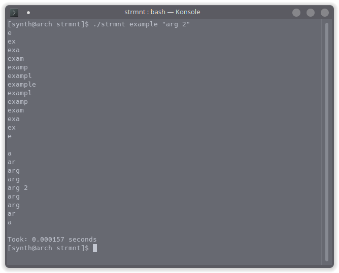

# strmnt
A simple program made in C that create a mountain of strings for each supplied argument
## Example

## Compiling
> If you have gcc and make installed:
```
make
```
## Suggestions
Please feel free to make suggestions for optimizations or for more things to add!
